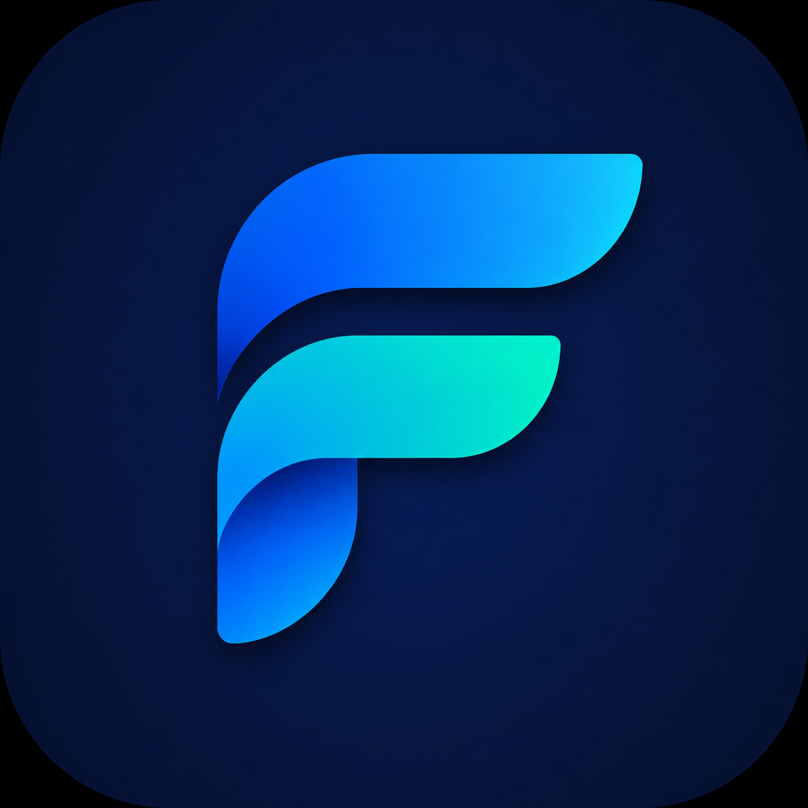

<div align="center">
  
  <br /><br />
  <h1>FileFlow</h1>
  <p><strong>A high-performance, privacy-first Android utility suite for offline document, PDF, and image processing.</strong></p>

  <p>
    <a href="#overview">Overview</a> &bull;
    <a href="#core-tools">Core Tools</a> &bull;
    <a href="#key-capabilities">Key Capabilities</a> &bull;
    <a href="#privacy--security">Privacy &amp; Security</a> &bull;
    <a href="#architecture">Architecture</a> &bull;
    <a href="#build--development">Build &amp; Development</a> &bull;
    <a href="#license">License</a>
  </p>

  <p>
    
    
    
    
    
    
  </p>
</div>

---

## Overview

FileFlow is a free, open-source, and lightweight Android application engineered for document conversion, PDF manipulation, image optimization, and document scanning.

Designed with an offline-first architecture, all operations are processed locally on the device hardware. There are no user accounts, no cloud uploads, no telemetry, and no advertising frameworks.

---

## Core Tools

FileFlow includes ten specialized processing tools:

| # | Tool | Description | Supported Formats |
|---|---|---|---|
| 1 | **Image to PDF** | Convert single or multiple images into a paginated PDF document with custom page sizes and orientations. | JPG, PNG, WebP &rarr; PDF |
| 2 | **PDF to Images** | Hardware-accelerated extraction of PDF pages into high-resolution images. | PDF &rarr; JPG, PNG, WebP |
| 3 | **PDF to DOCX** | Lightweight offline text structure and paragraph extraction into editable Microsoft Word documents. | PDF &rarr; DOCX |
| 4 | **DOCX to PDF** | Pure offline OpenXML parser that measures and paginates Word paragraphs to a PDF canvas. | DOCX &rarr; PDF |
| 5 | **PDF Compressor** | Multi-level raster and stream optimization (Extreme, Recommended, Light) to reduce file sizes. | PDF &rarr; PDF |
| 6 | **PDF Password Remover** | Decrypt and remove owner/user passwords when known. Passwords are never logged or persisted. | Encrypted PDF &rarr; Unlocked PDF |
| 7 | **PDF Merge** | Concatenate multiple PDF documents in any specified sequence into a single file. | Multiple PDFs &rarr; Single PDF |
| 8 | **PDF Split / Extract** | Extract specific page ranges (e.g. `1-3, 5, 8`) or burst all pages into standalone individual documents. | PDF &rarr; Split PDFs |
| 9 | **Image Compressor** | Downsample image dimensions, adjust quality factors, and convert between compression formats. | JPG, PNG, WebP |
| 10 | **Document Scanner** | Perspective-aware document capture with Magic Color, High-Contrast B&amp;W, and Grayscale filters. | Camera / Image &rarr; PDF |

---

## Key Capabilities

### User Interface and Interaction
- **Material 3 Floating Interface**: Floating top app bar and floating bottom navigation with 22dp radii surfaces.
- **Dynamic Theming**: Comprehensive support for System Default, Light, Dark, and true AMOLED Black themes.
- **Accents**: 14 curated color profiles alongside a custom HSL hex color palette generator.
- **Instant Launch**: Direct launch into the primary workspace with zero splash screen delays.

### File Handling &amp; SAF Integration
- **Storage Access Framework**: Persisted folder access permissions (`takePersistableUriPermission`) to eliminate repetitive destination prompts.
- **Collision Resolution**: Configurable duplicate handling with automatic indexed naming or replacement confirmation.
- **Custom Naming Formats**: Standardized timestamps and configurable document prefix templates.

---

## Privacy &amp; Security

> [!NOTE]
> FileFlow operates under a strict offline guarantee. The application manifest includes zero network permissions.

- **Zero Cloud Processing**: Files are never transmitted over local networks or the internet.
- **No Telemetry or Tracking**: No third-party analytical SDKs, crash report uploaders, or behavioral monitoring.
- **Ephemeral Sandbox**: Scratch files and intermediate bitmap caches are cleared immediately after processing completion.
- **Password Isolation**: Decryption keys provided for protected documents reside in memory only during the active operation lifecycle.

---

## Architecture

FileFlow is structured according to Android architecture principles:

```
app/src/main/java/com/salik/fileflow/
├── core/
│   ├── datastore/       # DataStore preference persistence
│   ├── engine/          # Processing engines
│   │   ├── docx/        # Pure offline OpenXML docx & pdf conversions
│   │   ├── image/       # Image compression and scaling
│   │   ├── pdf/         # PDFBox & native PdfRenderer engines
│   │   └── scanner/     # Filter and matrix transformations
│   ├── history/         # Local metadata repository
│   ├── model/           # Data models and domain types
│   └── saf/             # Storage Access Framework & document helpers
├── ui/
│   ├── components/      # Floating bars, cards, progress bars
│   ├── screens/         # Home, Tools, Processing, History, Settings, Changelog
│   └── theme/           # Color schemes, typography, shapes, dynamic palettes
├── FileFlowApp.kt       # Application initialization
└── MainActivity.kt      # Single-activity Jetpack Compose navigation entry
```

---

## Build &amp; Development

### Prerequisites
- JDK 17
- Android Studio Ladybug (2024.2.1) or newer
- Android SDK 35 (`minSdk 26`, `targetSdk 35`)

### Commands

```bash
# Clone repository
git clone https://github.com/zer0k7/FileFlow.git
cd FileFlow

# Execute unit tests
./gradlew test

# Build debug APK
./gradlew assembleDebug

# Build release artifacts (arm64-v8a APK and App Bundle)
./gradlew assembleRelease
./gradlew bundleRelease
```

---

## Automated Releases

GitHub Actions automatically builds release artifacts when a version tag (e.g. `v1.0.0`) is published:
- `FileFlow-v1.0.0.apk` (Optimized 64-bit ARM architecture)
- `FileFlow-v1.0.0.aab` (Android App Bundle)

---

## License

This project is licensed under the Apache License, Version 2.0. See the [LICENSE](LICENSE) file for complete details.
